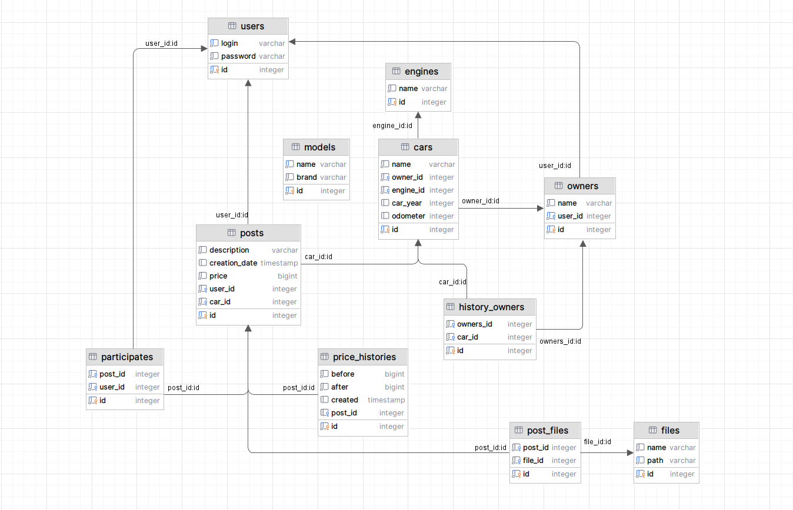

# Cars

The cars is a web application focused on the back end of a car sales/buy website. In particular, the use of the Hibernate framework.
I wrote the layout adapted for phones and tablets. All layouts were used under a free license.

**The main logic of the App:**
* registration, sign in, sign out
* displaying all posts on last day
* create and update post (on click profile)
* search car by filters in catalog
* displaying full information about one chosen post

Any user can watch posts, as well as view detailed information on any post.
Only registered users can add and edit their posts.

Please note that liquibase runs several dml scripts. It is important that one of the scripts loads the models into the database (*016_dml_insert_models_for_demo.sql*). In addition to this script, other dml scripts are needed exclusively for demo. Also for the demo on the site there are recommendations and recently viewed (this is a mock).

Spring Framework is used as the **main framework**. The pages are developed with Thymeleaf and Bootstrap and **dependencies** are used: PostgreSQL 42.5, Liquibase 4.15 and Hibernate 5.6.

**Environment requirements:** Java 17, PostgreSQL 42.5, Apache Maven 3+

**Used technologies:**
* Java 17
* Maven 3.1
* PostgreSQL 13.2 (deploy), 15 (local)
* Spring Boot 2.7
* Hibernate 5.6
* Junit Jupiter 5
* AssertJ 3
* Mockito 3.5
* Liquibase 4.15
* Sql2o 1.6
* H2database 2.1
* Thymeleaf 3.0
* Bootstrap 5.3
* Checkstyle 3.1
* JoCoCO 0.8

**How to run the project:**
1. To run the project, you need to clone the project from this repository;
2. Then you need to create a local database "cars";
3. Specify the login and password for the database you created in the db/liquibase.properties file;
4. Run liquibase to pre-create and autofill tables;
5. Launch the application using one of the following methods:
   5.1 Through the Main class, located in the folder src\main\java\ru\job4j\cars;
   5.2 Compiling and running the project via maven with mvn spring-boot:run;
   5.3 After building the project via maven and running the built file with the command java -jar job4j_cars-1.0-SNAPSHOT.jar;
6. Open the page http://localhost:8080/index in the browser;

**The database schema:**

You can contact me using the contacts in my profile.
Also try the live demo [here](https://carsrailway-production.up.railway.app/).

---

**App screenshots**

